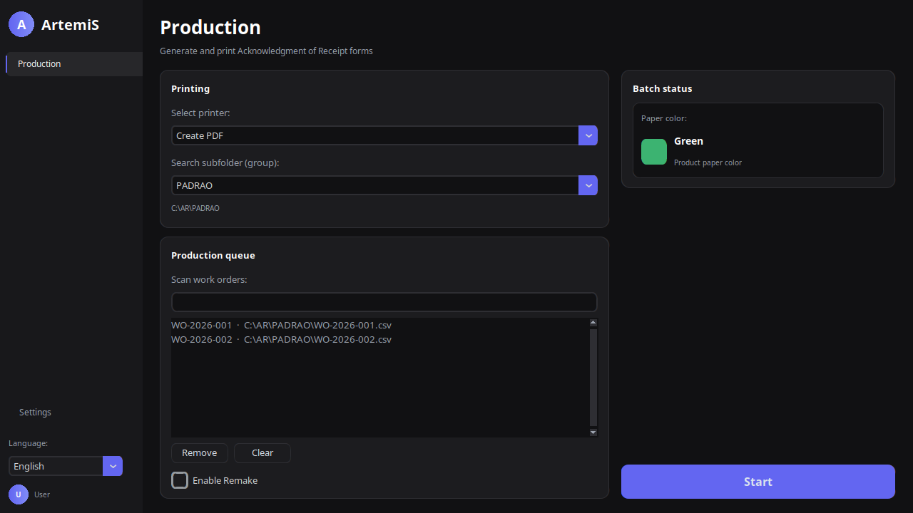
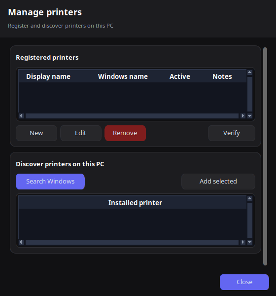
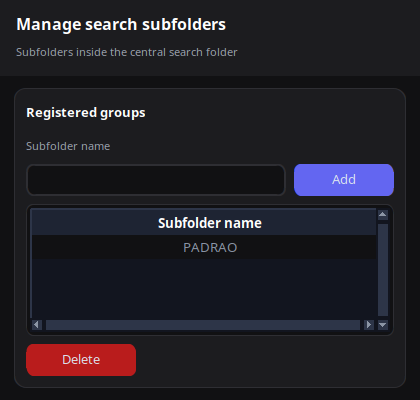
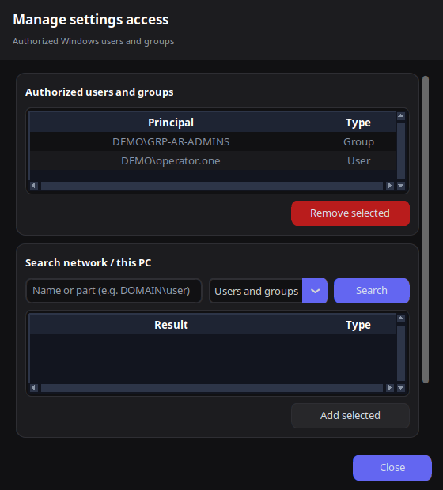
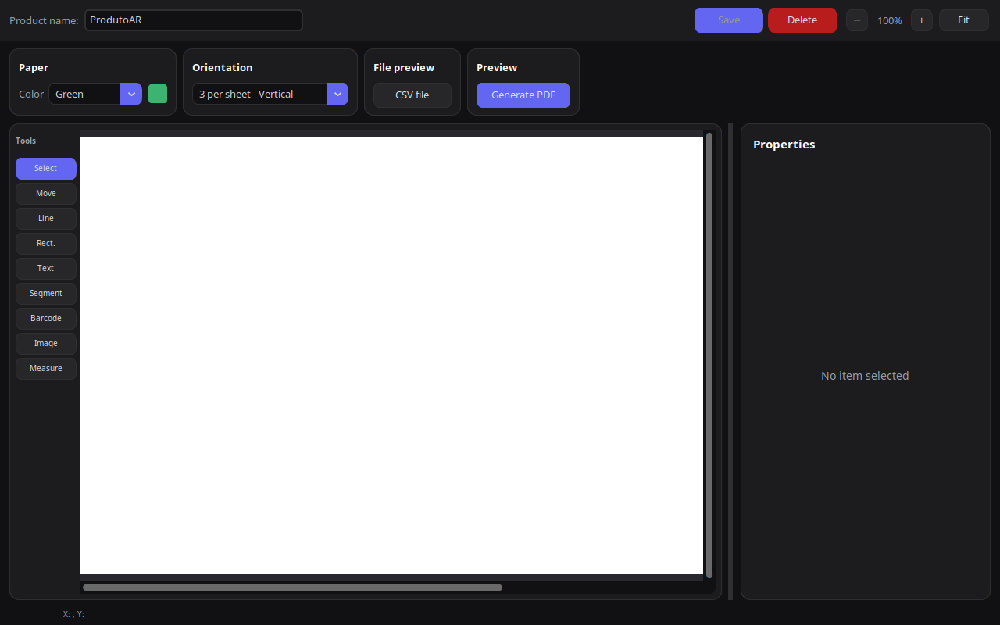

# Introduction

This guide is for people who **configure** ArtemiS: paths, printers, clients/products, template layouts, and who may open **Settings**.

Operators who only run daily batches should use the *Production User Guide* instead.

<div class="note">

**Access:** Settings opens only for Windows PC/domain administrators, or for users and groups explicitly authorized in **Manage access**. There is no separate ArtemiS password — your Windows login is used.

</div>

# Opening Settings

1. Start ArtemiS.
2. Click **Settings** at the bottom of the left sidebar.

If access is denied, your Windows account is not authorized. A domain administrator must add you under **Access → Manage access**.


*Figure 1 — Settings: clients and products on the left; configuration tabs on the right.*

# Settings layout

| Area | Purpose |
|------|---------|
| **Clients and products** | Search, add, edit, duplicate, delete |
| **General tab** | Folders, database path, audit, import/export |
| **Printing tab** | Registered printers, print engine, search groups |
| **Access tab** | Who may open Settings |
| **Language tab** | Default language, themes, extra translations |

# General tab — files and paths

## Central workorders folder

Root folder where CSV work orders are stored. Each **search group** is a **subfolder** inside this path.

Example:

```
C:\ArtemiS\Workorders\
    PADRAO\          ← group "PADRAO"
    EXPRESS\         ← group "EXPRESS"
    Old\             ← created automatically under each group after processing
```

After editing the path, click **Save**.

## Database path

Location of the SQLite database (`database.db`) with clients, products, layouts, printers, and access rules.

- **Single PC:** a local path is fine.
- **Multiple PCs:** point every station to the **same network path** (UNC), e.g. `\\server\ArtemiS\database.db`, so layouts stay in sync.

<div class="warning">

**Shared database:** Avoid editing clients or layouts from many PCs at the same time. SQLite on a network share can lock or corrupt if many users write simultaneously. Prefer one central administrator for layout changes.

</div>

## Audit / logs

Optional central audit database for configuration and production events. Leave empty to store audit data next to the main database.

Click **Audit / logs** to review recent actions.

## Import and export

- **Import** — load a product layout from a JSON file (from another site or backup).
- **Export** — save the selected product layout to JSON for backup or migration.


*Figure 2 — General tab: paths, audit, import/export.*

# Printing tab

## Registered printers

Printers shown on the Production screen are **registered** here, not every Windows printer automatically.

Click **Manage printers**:


*Figure 3 — Register Windows printer names and friendly display names.*

| Field | Meaning |
|-------|---------|
| **Windows name** | Exact name as shown in Windows Printers |
| **Display name** | Label operators see in the combo box |
| **Active on production screen** | Uncheck to hide without deleting |
| **Notes** | Optional reminder (tray, room, etc.) |

Use **Search Windows** to discover installed printers on the current PC, then **Add selected**.

<div class="tip">

Each production PC still prints to **its local** Windows printers. Register the same logical printer on every station where operators need it.

</div>

## Print engine

Choose how jobs are sent to the printer (e.g. PDFtoPrinter or Ghostscript). Click **Save engine** after changing.

Ghostscript status is shown on this tab. In deployed builds, Ghostscript ships inside the application folder.

## Search groups (subfolders)

Click **Manage search subfolders** to add or remove group names.


*Figure 4 — Group names map to subfolders under the central workorders folder.*

Adding a group **creates the matching folder on disk** if it does not exist. Operators then pick that group on the Production screen.

# Access tab

PC and domain administrators always have access to Settings.

To allow non-admin operators (e.g. prepress staff):

1. Open **Manage access**.
2. Search for a **domain user** or **domain group** (preferred).
3. Add the selected principal.


*Figure 5 — Authorized Windows users and groups.*

| Principal type | Example | Notes |
|------------------|---------|-------|
| Domain user | `COMPANY\maria.silva` | Works on any domain-joined PC |
| Domain group | `COMPANY\ArtemiS-Admins` | Recommended for teams |
| Local user | `PC-NAME\localuser` | Only valid on that PC |

Remove access by selecting a row and clicking **Remove selected**.

# Language and appearance

On the **Language** tab:

- **Default language on startup** — saved for all users on that PC (operators can still switch language on Production).
- **Extra language folder** — optional `.json` translation files.
- **Color theme** — applies after restarting ArtemiS.

# Clients and products

Every printable layout belongs to a **client** and **product** pair. The first line of each WO CSV identifies which layout to use.

## Add a client

1. Click **Add client**.
2. Enter a short name (e.g. customer code).
3. Confirm.

## Add a product

1. Select a client in the list.
2. Click **Add product**.
3. Enter product name, paper color, orientation, and paper size.
4. Save — the **template editor** opens for layout design.

## Edit an existing product

Select client → select product → **Edit** to open the template editor.

## Duplicate or delete

- **Duplicate** — copy a product under the same or another client (useful for small layout variants).
- **Delete client** — removes the client and all its products (requires confirmation).


*Figure 6 — Client list, product list, and actions.*

# Template editor (layout design)

The editor is where you place text, barcodes, logos, and lines on the AR form.


*Figure 7 — Visual editor with toolbox, canvas, and properties panel.*

## Canvas and orientation

Choose a sheet layout:

- Three ARs vertical
- Two ARs horizontal or vertical
- Full A4 sheet

Set **paper color** and size to match physical stock used in production.

## Tools (left toolbar)

| Tool | Use for |
|------|---------|
| Select | Move and resize elements |
| Line / Rectangle | Rules and boxes |
| Text | Fixed labels |
| Counter | Sequential numbers |
| Segment | Multi-part fields |
| Barcode | Code 128, Code 39, etc. |
| Image | Client logo (stored in database) |

Select an element to edit properties: position, font, rotation, CSV column binding, default value.

## CSV column binding

Variable fields (name, address, AR number) link to **CSV columns** from the work order file (e.g. `Coluna_2`). Use the properties panel to pick the column.

<div class="warning">

If a column name in the layout does not exist in the CSV, that field is **silently omitted** on the printed form. Always test with a real WO file before production.

</div>

## Testing a layout

Use **Test PDF** (or equivalent preview action) to generate a sample PDF and check alignment on paper.

## Keyboard shortcuts

| Key | Action |
|-----|--------|
| Delete | Remove selected element |
| Arrow keys | Nudge position |
| Ctrl+Z | Undo (up to 10 steps) |
| Ctrl+C | Duplicate selected elements (segments are not duplicated) |

Save the layout when alignment is correct. The product is then available the next time an operator scans a matching WO.

# Typical setup workflow

1. Set **central workorders folder** and **database path** (General).
2. Register **printers** and **search groups** (Printing).
3. Grant **access** to layout editors if they are not domain admins (Access).
4. **Add client** and **add product**.
5. Design and test the layout in the **template editor**.
6. Run a test batch from Production with **Create PDF** before going live on paper.

# Network deployment checklist

| Item | Recommendation |
|------|----------------|
| Database | Single UNC path, regular backup |
| Workorder folders | Shared or consistent paths per site |
| Settings access | Domain groups, not individual PCs |
| Layout changes | One administrator at a time |
| Printers | Register per production PC |
| Ghostscript / dist | Deploy full `dist/` folder from build |

# Troubleshooting (administrators)

| Problem | What to check |
|---------|----------------|
| Operator cannot open Settings | Access tab → add user/group; or use domain admin |
| Product not found on scan | Client/product names in CSV vs database |
| Wrong alignment | Template editor → Test PDF; check orientation and paper size |
| Printer not in list | Manage printers → register and mark active |
| Group missing on Production | Manage search subfolders → add group |
| Mixed paper error for operators | Same product/paper rules — expected behavior |

# Getting help

Keep exported JSON backups of critical products. Document your central folder layout and registered printer names for each production PC.

---

*ArtemiS Administrator Guide — English*
