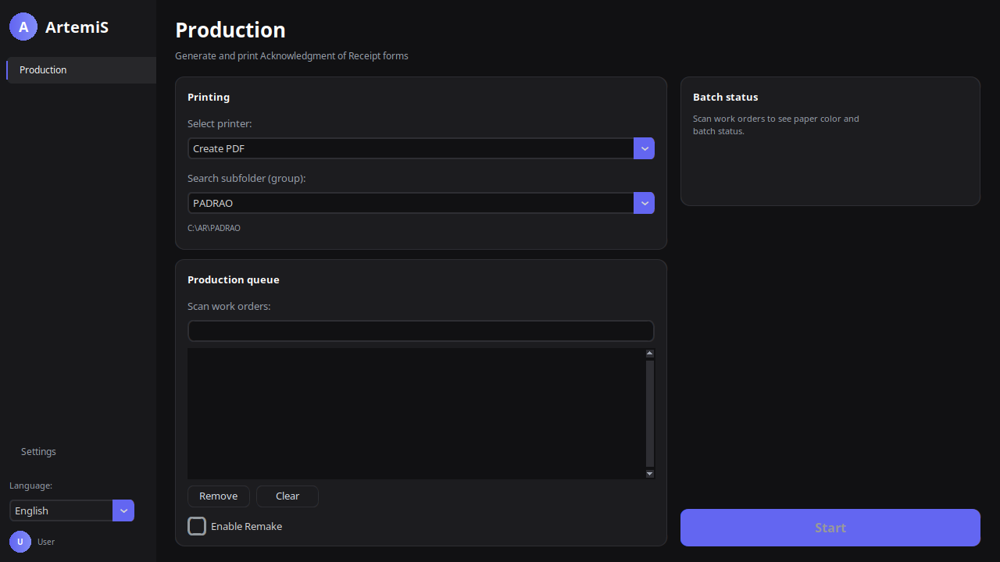
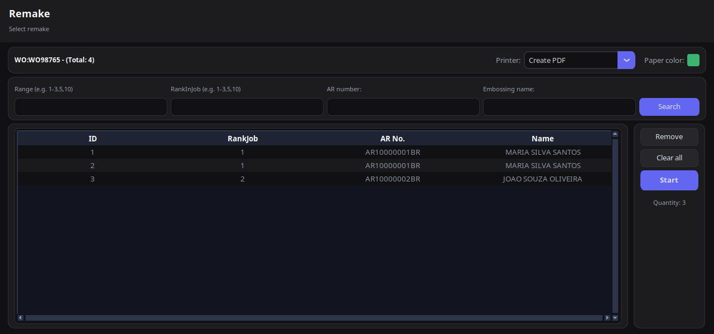

# Introduction

ArtemiS helps you print **Acknowledgment of Receipt (AR)** forms for Brazilian postal mailings in batch. You scan or type **work order (WO)** codes, build a queue, and press **Start** to generate and print the forms.

This guide covers the **Production** screen — the screen you use every day. It does not cover template design or system configuration (see the *Administrator Guide*).

**Who should read this guide?** Operators who scan work orders, load paper into printers, and run daily production batches.

# Opening ArtemiS

1. Start **ArtemiS** from the Windows Start menu or desktop shortcut.
2. The application opens on the **Production** screen.

*Figure 1 — Production screen: printer and group on the left, queue in the center, batch status and Start on the right.*

# Screen layout

| Area | Purpose |
|------|---------|
| **Left sidebar** | Switch to Production; change language; see your Windows user |
| **Printing card** | Choose printer and search subfolder (group) |
| **Production queue card** | Scan work orders and manage the list |
| **Batch status card** | Shows required paper color after the first WO is added |
| **Start button** | Runs PDF generation and printing for the whole queue |

# Before you start a batch

## 1. Select a printer

In **Select printer**, choose the physical printer for this batch.

- Pick **Create PDF** if you only need a PDF file (no printing). Useful for proofing or saving to disk.
- If your printer is not listed, ask your administrator to register it in Settings.

## 2. Select a search subfolder (group)

Work order CSV files are organized in subfolders under a central folder configured by IT.

Example path shown under the dropdown:

`C:\ArtemiS\Workorders\PADRAO`

Each **group** is one subfolder name (e.g. `PADRAO`, `EXPRESS`). Select the group that matches where today's files were dropped.

**Tip:** The path hint updates when you change the group. Use it to confirm you are looking in the right folder.

## 3. Load the correct paper

After you add the **first** work order to the queue, the **Batch status** panel shows the **paper color** required for that product (Green, Blue, Pink, Yellow, Ivory, or White).

*Figure 2 — Paper color appears after scanning the first work order.*

Load that color into the printer **before** pressing Start. ArtemiS blocks mixing different paper colors or paper sizes in the same batch.

# Adding work orders to the queue

1. Click inside **Scan work orders**.
2. Scan the WO barcode with your scanner, or type the code and press **Enter**.
3. The WO appears in the list below.

## If the work order is not found

A message asks you to pick the file manually or contact support. Common causes:

- Wrong **group** selected
- File not yet copied to the network folder
- Typo in the WO code

## Removing items

- Select one or more rows in the queue, then click **Remove**.
- Click **Clear** to empty the entire queue.

**Do not mix products.** All work orders in one batch must use the same paper color and paper size. If you scan a WO that does not match, ArtemiS shows an error and will not add it to the queue.

# Running a batch

When the queue is ready:

1. Confirm printer, group, and paper color.
2. Click **Start** (enabled only when at least one WO is in the queue).
3. Wait while ArtemiS generates PDFs and sends them to the printer.

Progress appears in the sidebar while jobs run. Up to five print jobs can run at once on busy stations.

## After a successful run

- Printed AR forms come out of the selected printer (or a PDF opens if you chose **Create PDF**).
- Processed CSV files are moved to an **Old** subfolder inside the batch folder — you normally do not need to move them manually.

## If something fails

- Read the on-screen message. It usually names the WO or printer involved.
- **Printer already in use** — wait for the current job on that printer to finish.
- **Maximum of 5 print jobs** — wait until a slot is free.
- **Create error** — note the message and contact support if it repeats.

# Remake — reprinting selected forms

Use **Remake** when a batch already ran but some ARs were misprinted or damaged.

1. Check **Enable Remake** at the bottom of the queue card.
2. Scan the same WO code again. ArtemiS looks in the **Old** folder instead of the active folder.
3. The **Remake** window opens (unless **Skip secondary screen** is checked).

*Figure 3 — Select only the records that need reprinting.*

## Filtering records in Remake

Use any combination of:

| Filter | Example | Finds |
|--------|---------|-------|
| **Range** | `1-3,5,10` | Rows by line number in the file |
| **RankInJob** | `1-3,5` | Rows by rank column |
| **AR number** | one per line | Specific AR numbers |
| **Embossing name** | partial name | Recipient name search |

Click **Search**, review the results table, then **Start** to reprint only those pages.

**Remake does not change the archived CSV.** The original file stays in **Old**; only the selected ARs are printed again.

# Changing language

At the bottom of the sidebar, open **Language** and pick your preference. The interface updates immediately on the Production screen.

Default language on startup is set by an administrator in Settings.

# Quick reference

| Task | Steps |
|------|-------|
| Normal batch | Printer → Group → Scan WOs → Check paper color → **Start** |
| PDF only | Select **Create PDF** as printer → scan WOs → **Start** |
| Fix one AR | **Enable Remake** → scan WO → filter → **Start** |
| Empty queue | **Clear** |
| Wrong WO in list | Select row → **Remove** |

# Getting help

- **Wrong paper color showing?** Verify the first WO in the queue — it sets the color for the whole batch.
- **Settings (gear) locked?** Only authorized Windows users can open configuration. Ask IT.
- **Printer missing?** Ask an administrator to register the printer in Settings → Printing.

---

*ArtemiS Production User Guide — English*
